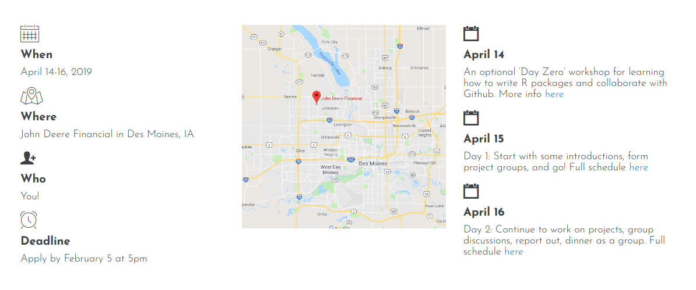

```{r setup, include=FALSE}
options(htmltools.dir.version = FALSE)
```

```{r pkgs, include=FALSE}
library(emo)
```
# About Us

Sam Tyner - postdoc, over-involved & over-committed DIYer 

Haley Jeppson - PhD student, sanity checker, plant mom

Ian Lyttle - Schneider Electric, enthusiastic helper

Heike Hofmann - extraordinary vault of knowledge & experience

Susan Vanderplas - computer problem debugger extraordinaire

### Not present 

Sam Helmich - John Deere, venue pro and food acquirer

Amelia McNamara - University of St. Thomas, super Github educator 

Angela Li - UChicago, expert organizer

---
# Who

The [participants](http://uuconf.rbind.io):

- represent the wide variety of skills and experience of all R users

  - from beginners to a member of R-Core
  
- are a diverse group from industry, academia, and government

<br />


---
background-image: url(http://uuconf.rbind.io/images/templogo.png)
background-size: 600px
background-position: 50% 80%
# Why 

To bring R users and developers together in flyover country.

---
# When & Where


---
class: inverse, center, middle
# What

---
# Day 0

### [Day-zero Preparation](https://uncoast-unconf.github.io/uu-2019-day-zero/00-preparation/) Ian Lyttle

### [Git and GitHub Cornucopia](https://uncoast-unconf.github.io/uu-2019-day-zero/01-git-github-cornucopia/git-github-cornucopia.html#1) Amelia McNamara

### [Project Workflows](https://uncoast-unconf.github.io/uu-2019-day-zero/02-project-workflows/workflow.html#1) Haley Jeppson

### [Packages](https://uncoast-unconf.github.io/uu-2019-day-zero/03-packages/package-development.html#1) Ian Lyttle

### [HTML-CSS-JS](https://uncoast-unconf.github.io/uu-2019-day-zero/04-html-css-js/Amelias-notes.html) Yihui Xie

---
# Projects (1 of 3)

### `r emo::ji("anchor")` [steward](https://github.com/uncoast-unconf/steward)   
- @ijlyttle @stephaniereinders @nikdata @AmandaRaeISU  

### `r emo::ji("stuck_out_tongue_closed_eyes")` [untidydata2](https://github.com/kwstat/untidydata2)

- @anneae @kwstat @giorgichi @davidbody  

### `r emo::ji("whale")` [whaler](https://github.com/uncoast-unconf/whaler)

- @ellisvalentiner @benjamincrary @shelmich @ajmcoqui


---
# Projects (2 of 3)

### `r emo::ji("scroll")` rolldown 

- @yihui @iqis @cpsievert

### `r emo::ji("earth_americas")` [ggcart](https://github.com/uncoast-unconf/ggcart)

- @charlesminshew @gergness @kmaurer @angela-li @hlendway @mdseege

### `r emo::ji("sweat_smile")` [Methods of Weird](https://github.com/uncoast-unconf/methods-of-weird). Modeling the weirdness of people. 

- @linkalis @mharmston @mkosmicki @cvanpay @drfletch


---
# Projects (3 of 3)

### `r emo::ji("cyclone")`  [Swirl course for writing an R package](https://github.com/lex-files/swirl_courses)  

- @lex-files @vfquirin @nooreendabbish

### `r emo::ji("eyes")` [opencv](https://github.com/uncoast-unconf/opencv)

- @gzt @speegled @minnesotka @wch

### `r emo::ji("heartbeat")` psyphyr: psychophysiological data wrangling 

- @wendtke @ajmcoqui @almccombs

---
# What we learned

```{r meme1, echo=F, fig.align='center', message=FALSE, out.width="50%"}
library(memer)
meme_get("SuccessKid")
```

---

```{r, fig.align='center', message=FALSE, out.width = "50%"}

meme_get("DosEquisMan") %>% 
  meme_text_top("I don't always write R packages,", size = 26) %>% 
  meme_text_bottom("but when I do, I'm at an unconf.", size = 26)
```

---
background-image: url(https://pbs.twimg.com/media/DfqjHpNU0AIuufg.jpg)
background-size: 1500px
background-position: 30% 30%
class: center middle inverse

# Questions? 


